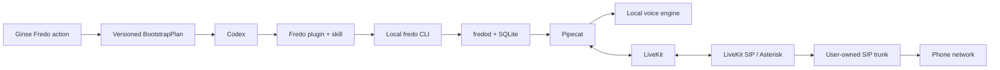

# Fredo — the local phone for Codex

**Discover it through Ginse. Install it on your Mac. Call from Codex.**

Fredo is a generic local telephony capability for Codex. Once installed, it turns a Codex request into a previewed, confirmed, real phone call powered by models running on the user's machine, then returns a structured result to the same task.

The hackathon proof is deliberately visible: start from Ginse, bootstrap Fredo locally, and make a judge's real phone ring from a verified number.

> [Version française](README.fr.md)

## Current status

This repository currently contains the product contract, target architecture, source pins and execution roadmap. The end-to-end caller is **not implemented yet**. Commands and component boundaries below describe what the team is about to build.

The measurable completion contract is [`GOAL.md`](GOAL.md). The ordered implementation plan is [`ROADMAP.md`](ROADMAP.md).

## Product flow



Ginse is the entry point and installation resolver. It is not the call backend. After bootstrap, the phone number, call intent, models, credentials, audio, transcript and state remain local.

## The promise

First use has two explicit stages because a newly installed Codex plugin is loaded by a fresh task: a bootstrap task starts from Ginse and ends at `fredo doctor`; a fresh Fredo task then owns the call.

Once installed, from one Codex task the user can:

1. ask Fredo to call a real destination;
2. inspect the number, caller identity, intent and duration limit;
3. explicitly confirm the call;
4. follow, interrupt or cancel it;
5. receive a structured result after hangup.

Every installation owns its models, data, SIP account or SIM, verified caller identity, policy and telecom bill. Fredo does not operate a shared call platform.

## Ginse-first bootstrap

Ginse apps expose one fixed HTTPS action and cannot directly call a user's `localhost`. Fredo therefore publishes one deterministic action that returns a schema-valid bootstrap plan:

```json
{
  "schema_version": 1,
  "product": "fredo",
  "profile": "mac-m4pro-24gb",
  "repository": "https://github.com/Caezarr/42hackathon",
  "commit": "<immutable-git-sha>",
  "manifest_url": "https://provider.example/fredo-mac-v1.json",
  "manifest_sha256": "<sha256>"
}
```

Codex verifies that plan, installs the Fredo plugin from the pinned revision, shows local downloads and permissions, then runs the local bootstrap after approval.

The Ginse provider never receives a phone number or call payload. See [`docs/GINSE.md`](docs/GINSE.md).

The provider itself is a mandatory, tiny service on a team-controlled public HTTPS Docker host. It serves plans and durable idempotency only. It is independent from the optional public SIP/RTP edge used when carrier networking requires one.

## Codex integration

Fredo is packaged as a Codex plugin:

- a skill owns the conversation workflow;
- the `fredo` CLI is the canonical local contract;
- `fredod` owns durable long-running calls;
- an optional STDIO MCP adapter may expose typed tools over the same contract.

MCP is not a second implementation. The skill can invoke the CLI directly when MCP is unavailable.

The hackathon demo uses Codex CLI with a local OSS provider so the reasoning surface does not require hosted inference. Fredo can support hosted Codex later, with that separate cloud boundary stated honestly.

Official Codex references:

- [Build Codex plugins](https://learn.chatgpt.com/docs/build-plugins)
- [Build Codex skills](https://learn.chatgpt.com/docs/build-skills)
- [Configure local MCP servers](https://learn.chatgpt.com/docs/extend/mcp)

## Reference machine

The only required hackathon profile is the inspected Mac:

- Apple M4 Pro;
- 24 GB RAM;
- macOS 26.5 on `arm64`;
- native Metal/MLX inference;
- isolated Python 3.12 runtime created by Fredo;
- Docker Compose allowed for media and telecom services.

Support for other Macs and Linux is post-hackathon work.

## The deliberately absurd stack

The hero path is excessive on purpose, but every layer has one job:

- **Fredo plugin + skill** — discovery and workflow inside Codex;
- **Fredo CLI + daemon** — stable JSON contract and asynchronous execution;
- **SQLite WAL** — durable jobs, events, confirmations and idempotency;
- **Pipecat** — realtime dialogue graph, VAD and interruption;
- **native local models** — STT, LLM and generic TTS on Apple Silicon;
- **LiveKit** — realtime media room and supervision;
- **LiveKit SIP** — SIP/media bridge;
- **Asterisk** — carrier quirks, DTMF, CDR and future SIM/Bluetooth transports;
- **operator-owned SIP trunk** — verified access to the public phone network.

The target media path is:

```text
Pipecat <-> LiveKit <-> LiveKit SIP <-> Asterisk <-> SIP carrier <-> judge
```

Fallbacks are evidence-driven: LiveKit SIP can connect directly to the trunk, or Pipecat can use Asterisk without LiveKit supervision. A public telecom edge is introduced only if NAT or the carrier makes it necessary; the small public Ginse provider already exists separately.

## Local voice engines

The reliable path is modular local STT -> LLM -> TTS. Exact models are selected after a benchmark on the reference Mac.

[Moshi](https://github.com/kyutai-labs/moshi) is the experimental full-duplex path. Its official repository provides an MLX backend and q4/q8 models for Mac, but it remains behind a feature flag until it beats the latency and memory gates in [`GOAL.md`](GOAL.md).

[PyVoIP](https://github.com/tayler6000/pyVoIP) is a pure-Python SIP/RTP laboratory adapter. Its documented PCMA/PCMU 8 kHz scope makes it useful for diagnostics, not the judged transport.

Voice cloning is a post-call nice-to-have. A generic local voice is the mandatory fallback.

## Safety boundary

Fredo is not a caller-ID spoofing or bulk-dialing tool.

The mandatory policy includes:

- a caller identity verified by the user's carrier;
- explicit one-use confirmation bound to destination and intent;
- blocked emergency, premium-rate, short-code and prohibited destinations;
- one active outbound call for the hackathon;
- visible automated-voice disclosure;
- recordings disabled by default;
- redacted logs and local transcripts;
- idempotent call creation and a local kill switch.

## Hackathon definition of done

The project passes only when:

- Fredo is published and verified on Ginse;
- a fresh bootstrap task obtains the Fredo plan from Ginse and installs it;
- a newly started Codex task loads the Fredo plugin;
- the reference Mac installs the pinned local runtime;
- `fredo doctor --json` is green;
- Codex previews and confirms a call;
- the judge's real phone rings from the verified number;
- local AI sustains a bidirectional conversation;
- the result returns to Codex;
- a second call downloads zero model or runtime bytes;
- the evidence bundle in [`GOAL.md`](GOAL.md) is complete.

## Repository map

```text
GOAL.md                    Measurable completion contract
ROADMAP.md                 Product and implementation roadmap
docs/ARCHITECTURE.md       Component roles and boundaries
docs/BOOTSTRAP.md          Ginse-to-local bootstrap contract
docs/TELEPHONY.md          Media and PSTN fallback ladder
docs/GINSE.md              Marketplace action and privacy boundary
docs/STACK-CANDIDATES.md   Verified research notes and unresolved choices
docs/decisions/            Accepted architectural decisions
deploy/upstreams.lock.json Pinned source candidates
scripts/clone-upstreams.sh Reproducible development clones
```

## Development source bundle

```bash
git clone https://github.com/Caezarr/42hackathon.git
cd 42hackathon
./scripts/clone-upstreams.sh core
```

This clones pinned development sources into the ignored `.upstreams/` directory. It is not the Fredo end-user installer.

See [`docs/STACK-CANDIDATES.md`](docs/STACK-CANDIDATES.md) before promoting an experimental component into the reference runtime.

Fredo is licensed under [Apache-2.0](LICENSE). Third-party source and model licenses remain their own and must be reviewed before redistribution.
