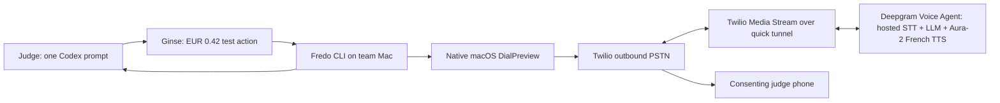

# Fredo — make a phone ring from Codex

**One Codex prompt → Ginse → native confirmation → a real consented phone call.**

> [Version française](README.fr.md)

Fredo is a guarded outbound phone capability for Codex. The immediate
hackathon profile runs the control surface on the team's Mac, uses Twilio for
PSTN access, and uses Deepgram Voice Agent for hosted French STT, dialogue and
TTS.

## Status

The runtime, CLI, French agent configuration, Twilio media bridge, automatic
tunnel, Codex plugin and tests are implemented. The package builds and the
offline suite passes.

**A real PSTN call is not verified yet.** This checkout has no Twilio Account
SID, Auth Token or caller number. A Deepgram key alone cannot access the phone
network. See [GOAL.md](GOAL.md) for the exact evidence still required.

## The intentionally ridiculous demo stack



This is the named `hosted-voice-mvp` profile. It is not an all-local inference
system: call audio and conversation context reach Deepgram, while Twilio sees
the destination and media transport. Ginse never receives the phone number,
intent, audio, transcript, credentials or result.

## Team-Mac setup

The current hackathon build targets Apple Silicon/macOS. The first Fredo
invocation runs the bootstrap script, installs missing `uv`/`cloudflared` via
Homebrew when available, and downloads the pinned dependency graph. The demo
operator performs this once:

```bash
git clone https://github.com/Caezarr/42hackathon.git
cd 42hackathon
./scripts/bootstrap.sh
uv run fredo configure
uv run fredo doctor --json
```

`fredo configure` asks privately for Deepgram and Twilio credentials, the
verified Twilio caller number, and one exact consenting +336/+337 destination.
It writes only an ignored mode-0600 `.env`; it never prints those secrets.

The Deepgram key shared during the hackathon must be rotated afterward. Never
paste it into source, a plugin, a Ginse payload or a client bundle.

## One-shot call

```bash
uv run fredo demo \
  --ginse-profile 'hosted-voice-mvp' \
  --ginse-demo-session-id '<demo_session_id>' \
  --ginse-expires-at '<expires_at>' \
  --to '+33600000000' \
  --intent 'Présenter Fredo et demander si la démonstration fonctionne'
```

The Fredo skill fills the three Ginse values from the successful EUR 0.42 test
run. They are shown here only for a manual operator smoke test.

The command:

1. refuses missing credentials, mock transport, invalid policy or a missing
   tunnel binary;
2. shows the complete destination, verified caller ID, purpose, disclosure and
   180-second cap in a native macOS dialog;
3. dials only after the human clicks **Appeler**;
4. creates a temporary Cloudflare tunnel for Twilio callbacks;
5. bridges μ-law 8 kHz audio between Twilio and Deepgram without transcoding;
6. returns a structured transcript/result, then tears down the local server and
   tunnel.

Closing the dialog means zero carrier call. Only exact pre-enrolled French
mobile numbers pass. Caller-ID spoofing, emergency/short/premium numbers,
recording, bulk calling and arbitrary remote tools are out of scope and blocked.

## Codex plugin

The repository includes a valid plugin and repo-scoped marketplace:

```text
.agents/plugins/marketplace.json
codex-plugin/fredo/.codex-plugin/plugin.json
codex-plugin/fredo/skills/fredo-call/SKILL.md
```

For local testing, add this checkout as a marketplace, then install Fredo:

```bash
codex plugin marketplace add .
codex plugin add fredo@fredo-local
```

Installed skills are loaded in a new Codex task/session. During an initial
same-task install, Codex invokes the newly installed `fredo` executable directly.

Target jury prompt:

> Use Ginse to prepare Fredo from `github.com/Caezarr/42hackathon`, then call
> `<PHONE_E164>`. This number belongs to a consenting judge. Introduce Fredo in
> French, disclose immediately that you are an automated synthetic voice, ask
> whether the demo works, then return the answer and a concise factual summary here.

## Ginse contract

Ginse is mandatory and deliberately narrow. Fredo exposes one fixed-price
action, **Prepare Fredo demo**, at EUR 0.42 of hackathon test balance. It accepts
only the platform/profile selectors and returns data-only compatibility/session
fields. Provider output never contains an installation command or URL because
Ginse correctly classifies builder output as untrusted data.

The provider contract requires Ed25519 bearer verification, strict schemas and
durable SQLite idempotency. Publishing and live verification remain before the
final jury gate. See [docs/GINSE.md](docs/GINSE.md).

## Commands

```text
fredo configure          private one-time team setup
fredo doctor --json      no-dial readiness report, secrets redacted
fredo demo ...           Ginse handoff + confirmation + tunnel + real call
fredo call ...           Ginse handoff through an already running voice service
fredo serve              persistent combined voice service
fredo serve --ginse-only marketplace provider without call routes
fredo secret             generate an endpoint secret
```

## Develop and verify

```bash
uv sync --frozen --extra dev
uv run ruff check src tests
uv run pytest
uv build
```

Container deployment through [Dockerfile](Dockerfile) and
[compose.yaml](compose.yaml) defaults to the isolated Ginse provider and a
persistent `/data` volume. Initialize the exact manifest with
`scripts/ginse-init.sh`, copy `.env.ginse.example` to ignored `.env.ginse`, and
run `docker compose --env-file .env.ginse up --build`. Compose passes only Ginse
provider variables; it never injects the voice-demo `.env`, Deepgram key or
Twilio credentials. See [docs/GINSE.md](docs/GINSE.md) for the verified order.

## Documentation

- [GOAL.md](GOAL.md) — active measurable hackathon contract
- [ROADMAP.md](ROADMAP.md) — implementation order
- [docs/ARCHITECTURE.md](docs/ARCHITECTURE.md) — architecture and future local path
- [docs/GINSE.md](docs/GINSE.md) — marketplace/provider contract
- [docs/TELEPHONY.md](docs/TELEPHONY.md) — telecom boundary
- [ADR 0005](docs/decisions/0005-hosted-voice-mvp.md) — why the MVP uses hosted voice
- [Pinned upstreams](deploy/upstreams.lock.json) — immutable source references

Fredo is Apache-2.0 licensed. The official Deepgram reference reused for the
media design is MIT licensed; see [THIRD_PARTY_NOTICES.md](THIRD_PARTY_NOTICES.md).
