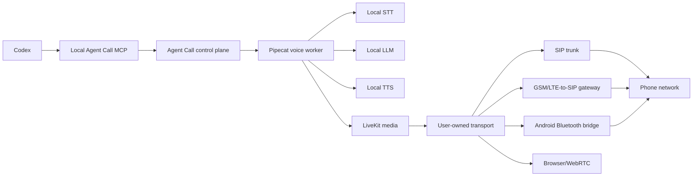

# Agent Call — 42hackathon

**A local-first phone appliance for Codex.**

Agent Call is being built to let Codex place phone calls through infrastructure owned by the user. Live-call models, audio processing, credentials, transcripts, call history, and telecom costs stay with each installation.

There is no shared calling backend and no central phone bill.

> Bootstrap a pinned release. Connect your own SIP account or SIM bridge. Then call without implicit runtime downloads.

> [Version française](README.fr.md)

## Status

This repository currently defines the hackathon product, architecture, source dependency pins, and build plan. Runtime image digests and model hashes are not locked yet. The end-to-end dialer is **not implemented yet**. Target commands below describe the experience we are building, not released functionality.

## What we are building



Every installation owns its:

- models and compute;
- SIP credentials or SIM;
- caller identity and telecom bill;
- transcripts, recordings, and audit logs;
- quotas, allowlists, and safety policy.

The AI pipeline, media control plane, and data storage can run locally. The selected SIP or cellular transport still depends on an external telecom network.

## Target experience

The target first run downloads and verifies the selected appliance profile:

```bash
git clone https://github.com/Caezarr/42hackathon.git
cd 42hackathon

agent-call init --compute auto --transport browser
agent-call plan
agent-call bootstrap --resume
agent-call doctor --offline
agent-call up --offline
```

The bootstrap caches pinned containers, models, and runtime dependencies. Once a selected release and profile reach `ACTIVE`, placing a call never triggers an implicit dependency download. Updates and profile changes remain explicit downloads.

Compute and telephony are independent choices:

| Compute | Intended target |
| --- | --- |
| `mac-metal` | Apple Silicon with native Metal acceleration |
| `linux-cpu` | Portable amd64/arm64, quantized models, low concurrency |
| `linux-nvidia` | vLLM, faster-whisper, and local streaming TTS |

| Transport | What it uses |
| --- | --- |
| `browser` | Local WebRTC; no public phone network |
| `sip` | The user's own SIP trunk and verified number |
| `gsm-sip` | A SIM inside a local GSM/LTE-to-SIP gateway |
| `android-bt` | Experimental Linux/Asterisk bridge to a paired Android phone and SIM |

## Demo flow

1. Install Agent Call on a laptop or user-owned server.
2. Bootstrap the local models and media services.
3. Connect a browser, personal SIP trunk, or SIM bridge.
4. Add the local Agent Call MCP server to Codex.
5. Ask: **“Call this allowed contact, explain the appointment change, then summarize the answer.”**
6. Confirm the destination and call intent.
7. The local agent places the call and returns a structured result.

No hosted STT, call-side LLM, or TTS API is required in the live-call pipeline. Codex remains the hosted command interface: the user's instruction and the structured result follow Codex's own service and privacy boundary. A SIP or cellular network is still required to reach a public phone number.

## Proposed stack

- **Codex MCP** — local tool boundary and human confirmation
- **Agent Call** — jobs, policy, quotas, audit, and transport control
- **Pipecat** — conversational voice pipeline
- **LiveKit + LiveKit SIP** — self-hosted realtime media and SIP bridge
- **LocalAI initially** — one local OpenAI-compatible STT/LLM/TTS gateway
- **vLLM + Speaches + Kokoro later** — higher-concurrency NVIDIA profile
- **Asterisk `chan_mobile`** — optional Android/SIM bridge on Linux
- **Docker Compose + native acceleration** — reproducible installation

The selected and pinned repositories, commits, and recorded license identifiers live in [`deploy/upstreams.lock.json`](deploy/upstreams.lock.json).

## Ginse

[Ginse](https://app.ginse.ai/) is optional. It neither hosts nor distributes this appliance.

A published Ginse app has one fixed HTTPS `run_url`. Therefore each operator who wants Ginse publishes their own secured, publicly reachable Agent Call endpoint. Ginse cannot invoke `localhost`; MCP-only operation stays private and local. There is deliberately no universal broker routing everybody's calls through us.

See [`docs/GINSE.md`](docs/GINSE.md).

## Safety by construction

Agent Call is not a caller-ID spoofing or bulk-dialing product.

The appliance is designed to enforce:

- a caller identity owned by the operator's SIM or verified by their SIP provider;
- explicit confirmation before initiating calls;
- E.164 validation and configurable country allowlists;
- blocked emergency, premium-rate, short-code, and prohibited destinations;
- duration, concurrency, and optional spend limits;
- local audit events and idempotent call creation;
- recordings disabled by default;
- visible bot disclosure and consent controls;
- no autonomous contact scraping or mass dialing.

Operators remain responsible for consent, recording rules, and telecom law in their jurisdiction.

## Non-goals

We are not building:

- a centralized calling SaaS;
- a shared SIP carrier;
- caller-ID spoofing;
- an anonymous robocalling platform;
- a cloud service collecting everyone's conversations;
- a claim that PSTN calls work without a SIM, SIP provider, or carrier.

## Hackathon definition of done

- [ ] Resumable first-run bootstrap from a clean machine
- [ ] Tested Apple Silicon reference profile
- [ ] Fully local STT → LLM → TTS loop
- [ ] Browser/WebRTC conversation demo
- [ ] One outbound call through a user-owned transport
- [ ] Codex MCP tools with confirmation, status, and cancellation
- [ ] Local logs, quotas, and destination policy
- [ ] Reproducible Compose appliance
- [ ] Verified Ginse listing for the team's own demo installation
- [ ] Installation guide another participant can follow unaided

The implementation tasks and exit evidence for each milestone are tracked in [`docs/HACKATHON-PLAN.md`](docs/HACKATHON-PLAN.md).

## Repository map

```text
docs/
  ARCHITECTURE.md       System boundaries and call flows
  BOOTSTRAP.md          Resumable first-run installer contract
  TELEPHONY.md          Browser, SIP, GSM, and Android transports
  GINSE.md              Optional per-install publication model
  HACKATHON-PLAN.md     Milestones and definition of done
deploy/
  upstreams.lock.json   Selected source commits and license identifiers
scripts/
  clone-upstreams.sh    Reproducible development clones
```

## Documentation

- [Architecture and ownership boundaries](docs/ARCHITECTURE.md)
- [First-run bootstrap contract](docs/BOOTSTRAP.md)
- [Telephony transports and networking](docs/TELEPHONY.md)
- [Optional Ginse integration](docs/GINSE.md)
- [Hackathon plan and must-win demo](docs/HACKATHON-PLAN.md)
- [Security and abuse boundaries](SECURITY.md)
- [Contribution guide](CONTRIBUTING.md)

## Contributor quick start

```bash
git clone https://github.com/Caezarr/42hackathon.git
cd 42hackathon
./scripts/clone-upstreams.sh
```

This clones the pinned **development source bundle** into the ignored `.upstreams/` directory. It is not the future end-user installer. See [`CONTRIBUTING.md`](CONTRIBUTING.md) before changing the architecture or adding a provider.

Optional development source bundles are `android-bt`, `linux-nvidia`, and `all`; these names select source trees, not deployable runtime artifacts.

## Thesis

AI phone agents should behave like software you own, not another call platform you rent.

Agent Call turns a laptop, workstation, or home server into a private voice appliance: live-call inference and phone data stay local, the telephone connection belongs to the user, and Codex provides the hosted command interface.

Licensed under the [Apache License 2.0](LICENSE). Third-party source and model licenses remain their own and are tracked separately.
