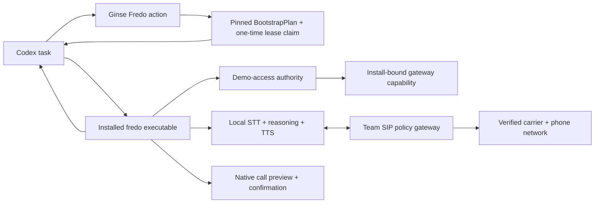

# Fredo — the local phone for Codex

**Discover through Ginse. Type one prompt. Make a real phone ring.**

Fredo is a generic phone capability for Codex. The judged target is a single natural-language prompt that bootstraps the pinned Mac runtime, previews and confirms a call, runs the live conversation with local call-side models, and returns the result to the same Codex task.

> [Version française](README.fr.md)

## Current truth

Fredo is **not implemented end to end**. This repository currently contains the normative goal, roadmap, architecture research, source pins, and an isolated [voice-cloning proof of concept](voice-clone-poc/README.md). There is no Fredo plugin, runtime, Ginse provider, policy gateway, or verified PSTN call yet.

- [`GOAL.md`](GOAL.md) is the normative acceptance specification.
- [`ROADMAP.md`](ROADMAP.md) orders implementation by evidence.

## Judged experience

The judge types once:

> “Use Ginse to prepare Fredo, then call `<PHONE_E164>`. This number belongs to a consenting judge. Introduce Fredo in French, disclose immediately that you are an automated synthetic voice, ask whether the demonstration works, then return the answer here.”

The flow may show declared Codex/macOS installation approvals and one Fredo-owned call-confirmation dialog. It may not require a shell command, credential paste, source edit, prerequisite installation, or second typed prompt.



Codex documentation requires a new chat or CLI session before newly installed plugin skills become available. The original bootstrap task therefore invokes the installed `fredo` executable directly for the first call. A fresh session verifies plugin discovery afterward.

## Ginse is essential, not the call backend

Fredo publishes one fixed-price Ginse action: **Resolve a Fredo demo bootstrap**.

Ginse receives only the supported Mac profile, a prompt-independent random install ID, and the thumbprint of a protected device key created locally before the action. The returned plan pins the repository commit, artifact manifest, plugin identity, policy digest, and a short-lived claim bound to that key with no dialing authority. The destination and call intent stay outside Ginse.

After installation, Fredo proves possession of the precommitted device key and idempotently exchanges the claim for an install-bound capability to the team's SIP policy gateway. The gateway holds the shared demo carrier credential and enforces issuance, spend, rate, total-attempt, duration, exact-destination, concurrency, and revocation limits. Judges therefore use the team's telecom access without receiving its carrier master key. BYOK is post-hackathon work.

## Honest locality boundary

Local means the live conversation intelligence and durable Fredo state run on the Mac:

- local STT, dialogue inference, TTS, state, and transcript;
- no hosted call-side STT, LLM, TTS, or voice-agent API;
- no call audio sent to Codex, Ginse, or model registries;
- hosted Codex may orchestrate the bootstrap;
- Ginse/provider are bootstrap services;
- the gateway/carrier/PSTN remain necessary telecom boundaries.

The gateway may relay SIP/RTP but must not record audio or receive prompts, transcripts, model state, or summaries.

## Codex packaging

The target package is a Codex plugin containing a Fredo skill. The local executable is the canonical automation boundary; an optional STDIO MCP adapter may expose the same domain operations but may not own unique business logic.

The installed CLI currently supports Git-backed marketplace refs through `codex plugin marketplace add ... --ref <sha>` and plugin installation through `codex plugin add`. Plugin capabilities are tested in a new session after installation.

Official references:

- [Build Codex plugins](https://learn.chatgpt.com/docs/build-plugins)
- [Build Codex skills](https://learn.chatgpt.com/docs/build-skills)
- [Configure local MCP servers](https://learn.chatgpt.com/docs/extend/mcp)

## Architecture hypothesis

The intentionally excessive laboratory path remains:

```text
Fredo -> durable local state -> Pipecat -> local voice models
      -> LiveKit -> LiveKit SIP -> Asterisk/policy gateway -> carrier -> phone
```

Pipecat, LiveKit, Asterisk, PyVoIP, SQLite, Python, Docker, and Moshi are hypotheses, not acceptance criteria. The judged implementation may replace any of them if it preserves the invariants and passes every gate in `GOAL.md`.

- Moshi-MLX is a feature-flagged full-duplex experiment.
- PyVoIP is a diagnostic SIP/RTP adapter, not the trusted judged transport.
- Voice cloning is a consented stretch feature; a generic local voice is mandatory.
- A preinstalled container runtime is forbidden as a clean-machine prerequisite.

## Safety boundary

The mandatory demo policy includes:

- one verified team caller identity;
- exact pre-enrolled E.164 allowlists, default deny; `+336` and `+337` are only eligible classes, never wildcard access;
- one native, one-use confirmation bound to the complete canonical call request;
- bounded judge/qualification capability profiles, total-attempt and completion quotas, one concurrent call, and a 180-second hard duration cap;
- a global gateway concurrency limit and EUR 50 carrier-account cap for judging;
- synthetic-voice disclosure as the first substantive audio;
- no emergency, premium-rate, anonymous, scraped, bulk, or non-consensual calls;
- recordings disabled;
- at-most-once dialing, fail-closed revocation, redacted results, and a kill switch.

## Definition of done

The project passes only when the exact candidate bytes complete the staged acceptance cycle in [`GOAL.md`](GOAL.md): contracts, one-prompt clean bootstrap, 100-turn local benchmark, safety and crash tests, five controlled calls, one real jury call, evidence graph, Ginse verification, and promotion to matching public Git and Ginse releases.

## Repository map

```text
GOAL.md                    Normative acceptance specification
ROADMAP.md                 Evidence-ordered implementation roadmap
docs/ARCHITECTURE.md       Non-normative component hypothesis
docs/BOOTSTRAP.md          First-run and recovery design
docs/TELEPHONY.md          Telecom and media boundary
docs/GINSE.md              Single marketplace action contract
docs/STACK-CANDIDATES.md   Verified research and open choices
docs/decisions/            Accepted architectural decisions
deploy/upstreams.lock.json Pinned source candidates, not a runtime manifest
voice-clone-poc/           Independent stretch experiment
```

## Development source bundle

```bash
git clone https://github.com/Caezarr/42hackathon.git
cd 42hackathon
./scripts/clone-upstreams.sh core
```

This clones pinned development sources into `.upstreams/`. It is not the Fredo installer and does not prove runtime readiness.

Fredo is licensed under [Apache-2.0](LICENSE). Third-party source and model licences remain their own and must be reviewed before redistribution.
