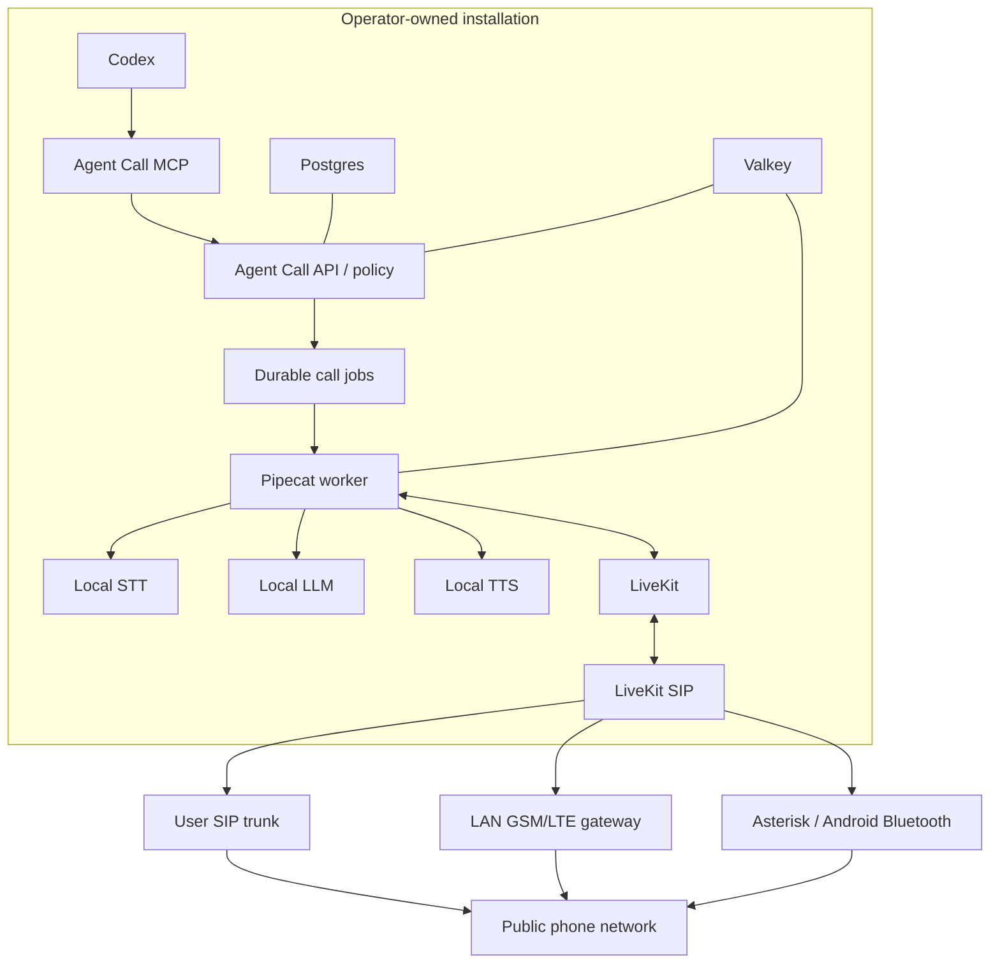

# Architecture

Status: target architecture for the hackathon implementation.

## Product boundary

Agent Call is software distributed to operators. It is not a shared call platform.

Each installation owns:

- runtime and model execution;
- database and model cache;
- phone transport and caller identity;
- secrets, logs, transcripts, and recordings;
- limits, destination policy, and telecom costs.

The project may publish source, signed images, manifests, and updates. It does not proxy downstream calls.

## Component map



## Planes

### Control plane

Agent Call owns jobs, confirmation, destination policy, quotas, idempotency, audit, and provider configuration. It never embeds carrier or model credentials in browser code.

### Codex boundary

The default integration is a local MCP server. Target tools:

- `agent_call.doctor`
- `agent_call.call_start`
- `agent_call.call_status`
- `agent_call.call_cancel`
- `agent_call.call_result`

Starting a live call must require confirmation and return a durable operation identifier.

The MCP server and call pipeline are local, but Codex itself is a hosted command interface. The user's request and the structured tool result remain inside Codex's own service boundary; raw live-call audio and the call-side transcript do not need to be sent to Codex.

### Voice plane

Pipecat owns the streaming STT → LLM → TTS pipeline and interruption behavior. LiveKit owns realtime media rooms, browser supervision, and the self-hosted SIP bridge.

### Inference plane

The first vertical slice uses LocalAI as one local OpenAI-compatible gateway. Production-oriented profiles may split into vLLM, Speaches/faster-whisper, and Kokoro without changing the Agent Call contract.

### Transport plane

Every phone transport implements the same lifecycle:

```text
configure -> doctor -> dial -> events -> hangup
```

Compute selection and phone transport selection are independent.

## Runtime profiles

### Apple Silicon

- UI/API and state services may run in containers.
- LLM, STT, and TTS should run natively where Metal acceleration is materially better.
- Containers reach native inference through a restricted local endpoint.
- Android Bluetooth transport is not supported directly because `chan_mobile` depends on Linux and BlueZ.

### Linux CPU

- Fully containerized amd64/arm64 target.
- Quantized local models and low concurrency.
- Suitable for development and short calls, not fleet-scale throughput.

### Linux NVIDIA

- vLLM or LocalAI CUDA for the LLM.
- Speaches/faster-whisper for STT.
- Kokoro-compatible local TTS.
- Explicit GPU reservations and independent health probes.

## Data and secret ownership

The target data root is selected by the operator and survives application upgrades:

```text
agent-call-home/
  config/
  secrets/
  manifests/
  cache/
  models/
  runtimes/
  data/
  state/
  run/
  recordings/
  backups/
```

Generated secrets never enter Git. Recording and hosted telemetry are disabled by default. Logs redact phone numbers and secret-like fields.

## Network boundary

Fully local inference does not mean the public phone network is offline.

- Browser/WebRTC can remain local.
- SIP calls require the operator's carrier connection.
- GSM calls require the cellular network.
- A Ginse-published instance requires public HTTPS.
- Postgres, Valkey, inference services, and internal worker endpoints remain private.

## Non-goals

- central multi-tenant call execution;
- arbitrary caller-ID presentation;
- automatic bulk dialing;
- mandatory cloud AI;
- hiding a remote provider behind the word “local”.
