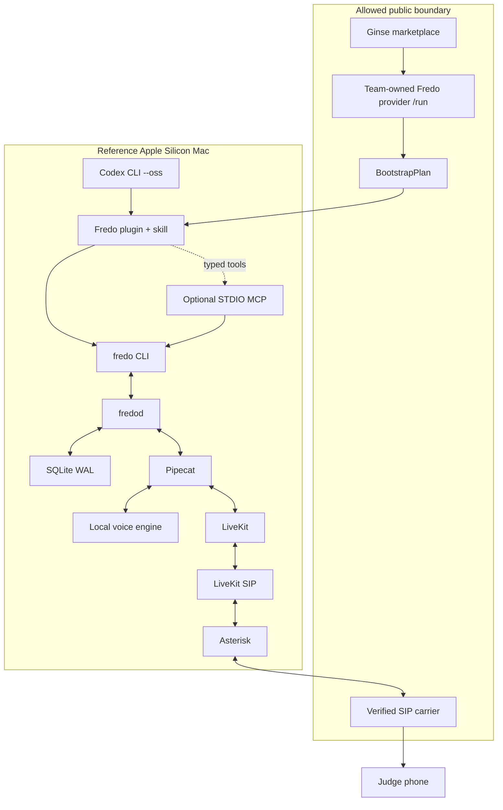
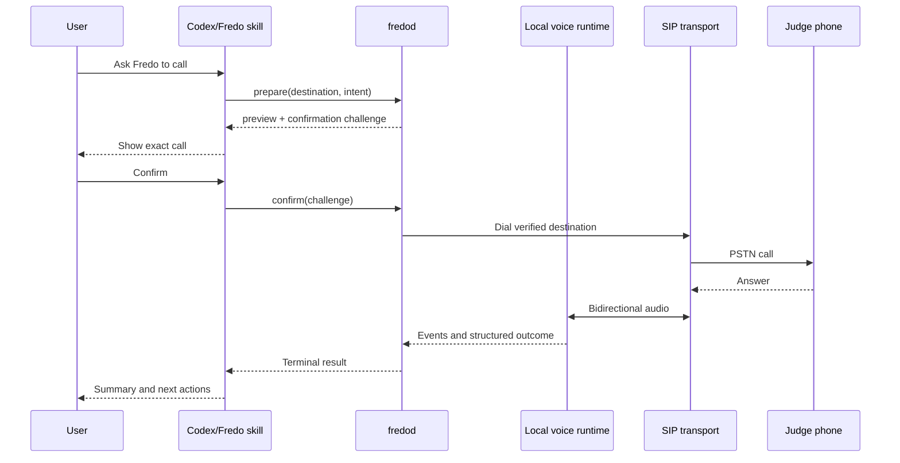

# Fredo architecture

Status: target architecture. No end-to-end runtime exists yet.

## Invariants

- Ginse is Fredo's required discovery and bootstrap entry point.
- Calls execute on infrastructure owned by the installer.
- Phone numbers, intents, credentials, audio and transcripts never transit through Ginse.
- The CLI/domain layer is canonical; Codex adapters stay thin.
- Live-call AI runs locally on the reference Mac.
- The carrier is the only unavoidable external dependency during a public phone call.
- Every side effect is confirmed, durable and idempotent.

## System map



The first telecom fallback may bypass Asterisk (`LiveKit SIP -> carrier`). The second may bypass LiveKit supervision (`Pipecat -> Asterisk`). A public telecom edge is introduced only when the carrier or NAT requires it. The small public Fredo provider is mandatory regardless and is a separate role.

## Component responsibilities

### Ginse resolver

One public fixed-price HTTPS action maps a small supported platform profile to a deterministic `BootstrapPlan`.

The team hosts this minimal provider on a public HTTPS Docker host selected in P0. It stores provider authentication/idempotency state and bootstrap plans only. It may share a machine with a future telecom edge, but it has no access to SIP, contacts or call data.

It owns:

- Ed25519 bearer verification;
- Ginse idempotency and stable operation IDs;
- input/output schema validation;
- immutable Fredo commit and manifest selection.

It never owns calls, local installation, contacts or telecom credentials.

### Codex plugin

The plugin is the installable user-facing package. It contains:

- a skill describing Fredo's safe workflow;
- CLI bootstrap/invocation instructions;
- optional `.mcp.json` wiring for a local STDIO adapter;
- no model weights or secrets.

Codex CLI supports local plugins, skills, local STDIO MCP servers and an OSS provider mode. The hackathon profile uses those local surfaces.

### `fredo` CLI

The CLI is the stable automation boundary for Codex, tests and humans. Every non-interactive command supports JSON output and meaningful exit codes.

```text
bootstrap plan|apply
doctor
call prepare|confirm|start|status|cancel|result
```

The CLI performs no long-running media work itself. It calls `fredod` over a local Unix socket.

### Optional MCP adapter

The STDIO server mirrors the CLI/domain operations as typed tools. It contains no transport, confirmation, storage or call logic. Removing it must not remove any Fredo capability.

### `fredod`

The daemon owns:

- state transitions and durable jobs;
- one-use confirmations;
- destination and identity policy;
- idempotency;
- voice and transport lifecycle;
- redacted event emission;
- recovery after process restart.

### SQLite

SQLite WAL is sufficient for the single-machine, single-call hackathon profile. Minimum records:

- `calls`;
- `call_events`;
- `jobs`;
- `confirmations`;
- `artifacts`;
- `transports`.

Postgres and Valkey are explicitly deferred until concurrency or a multi-process deployment proves they are needed.

### Pipecat

Pipecat owns the realtime conversation graph, VAD, turn detection, interruption and voice-engine adapters. It propagates one `call_id` through every event and transport layer.

### Local voice engine

The reference engine is selected by a benchmark, not by documentation preference.

Reliable modular path:

```text
streaming local STT -> compact local LLM -> generic local TTS
```

Experimental path:

```text
Moshi-MLX q4 full-duplex speech-to-speech
```

Inference runs natively on the Mac to preserve Metal/MLX acceleration. Fredo creates an isolated Python 3.12 runtime because the reference system Python is 3.14 and Moshi currently recommends 3.12.

### LiveKit

LiveKit owns the realtime room, media routing and optional local supervision surface. It does not own business policy or carrier credentials.

### LiveKit SIP

LiveKit SIP bridges the realtime room to SIP. It can connect directly to the verified carrier trunk or to Asterisk.

### Asterisk

Asterisk is the telecom boundary for carrier-specific behavior, codec negotiation, DTMF, call detail and future SIM/Bluetooth adapters. It may be removed from the critical path if direct LiveKit SIP proves more reliable for the judged trunk.

### PyVoIP lab adapter

PyVoIP is useful for a minimal pure-Python SIP/RTP diagnostic. Its documented PCMA/PCMU and telephone-event support is narrow, and the audio buffering/resampling layer remains Fredo's responsibility. It is not the trusted judged-call transport.

## Call lifecycle

```text
draft
  -> awaiting_confirmation
  -> ready
  -> dialing
  -> ringing
  -> connected
  -> completed | failed | cancelled
```

A confirmation binds:

- resolved destination;
- verified caller identity;
- user-visible intent;
- duration cap;
- expiry time;
- unique call request fingerprint.

Changing any bound field requires a new confirmation.

## End-to-end sequence



## Data and network boundary

### Bootstrap network

Allowed after explicit approval:

- Ginse action and manifest;
- pinned Git repository revision;
- pinned model/runtime artifacts;
- container registry content used by the selected profile.

### Live-call network

The zero-hosted-AI hackathon profile permits:

- local loopback and container networking;
- SIP signaling and RTP to the verified carrier;
- optional WireGuard to an operator-owned edge when required.

Ginse, model registries and hosted inference endpoints are not needed during the call.

## Local data root

```text
<operator-selected-data-root>/
  config/
  secrets/
  manifests/
  artifacts/
  models/
  runtimes/
  fredo.sqlite3
  run/
  transcripts/
  evidence/
```

Recordings are disabled. Logs redact phone numbers and secrets. Transcripts are local and optional for the demonstration.

## Deployment profiles

### `mac-m4pro-24gb` — required

- native daemon and inference;
- isolated Python 3.12 environment;
- local Docker Compose for media/telecom services when useful;
- one outbound call at a time.

### `ginse-provider-public` — required

- team-controlled HTTPS Docker host;
- Fredo `/run`, manifest and durable idempotency store only;
- no models, SIP credentials, phone numbers or call artifacts.

### `mac-plus-telecom-edge` — conditional

- Mac retains Fredo state and inference;
- operator-owned Linux edge runs public media/SIP and may colocate the already-required Ginse provider;
- WireGuard joins both hosts;
- activated only when networking evidence requires it.

### Everything else — post-hackathon

Linux inference, NVIDIA, GSM gateways, Android Bluetooth and multi-call deployments are outside the active goal.

## Non-goals

- central Fredo call execution;
- caller-ID spoofing;
- bulk or anonymous dialing;
- hosted call-side AI;
- mandatory MCP;
- mandatory public telecom edge;
- production-grade multi-user scaling during the hackathon.
