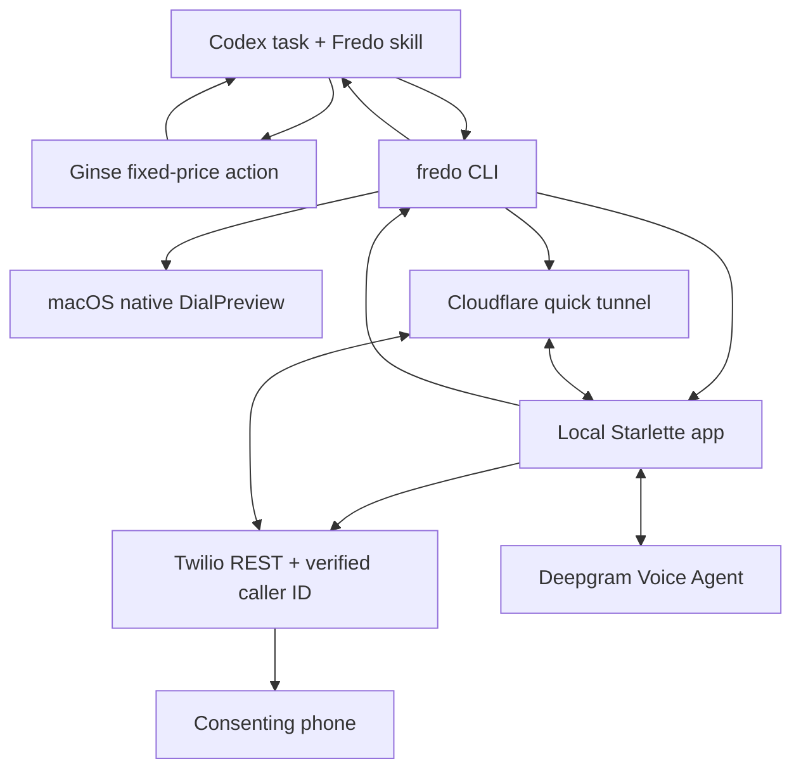
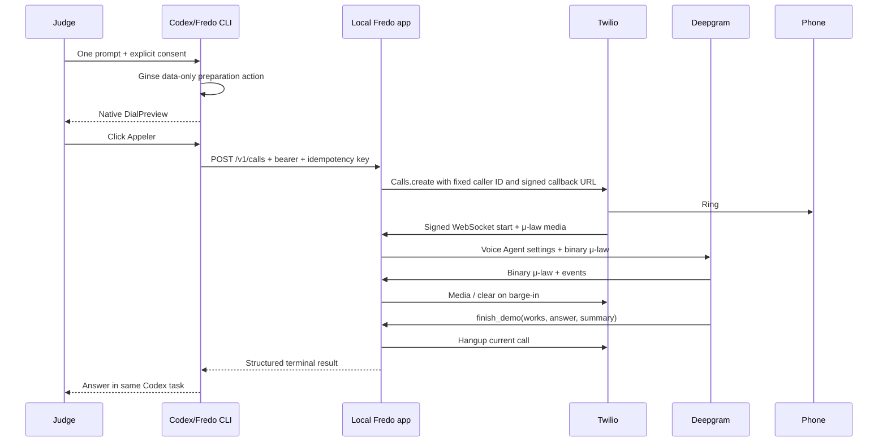

# Fredo architecture — hosted voice MVP

Status: implemented architecture for `GOAL.md` `0.4-draft`; real call remains
unqualified until the live gates pass.

## Components

## Local runtime

`fredo demo` owns the complete one-shot lifecycle:

1. load `.env` without logging values;
2. structurally validate the short-lived Ginse session handoff;
3. normalize and enforce the local destination/intent policy;
4. run no-dial readiness checks;
5. render the full native call preview;
6. start `cloudflared` and capture its HTTPS origin;
7. start the Starlette app on loopback;
8. send one authenticated/idempotent local call request;
9. wait for a terminal call result;
10. stop Uvicorn and the tunnel.

The public tunnel exposes Twilio callbacks to the same local app. `/v1/calls`
remains protected by `FREDO_ENDPOINT_SECRET`; the CLI talks to it on loopback.
Twilio status and WebSocket handshakes require `X-Twilio-Signature`.

## Call sequence

## Voice configuration

- input/output: μ-law mono, 8 kHz, no transcoding;
- STT: `flux-general-multi`, version v2, `language_hints=["fr"]`;
- dialogue: Deepgram-managed `open_ai/gpt-4o-mini` default;
- TTS: `aura-2-agathe-fr` default;
- first greeting discloses automated synthetic voice and no recording;
- only function: `finish_demo(works, answer, summary)`.

Model names are configuration values but the judged release freezes them.
Changing a model invalidates live-call evidence.

## State and idempotency

The current `CallRegistry` is guarded by one asyncio lock. It records:

- opaque call ID and masked destination hint;
- normalized purpose;
- Twilio SID in memory only;
- state, transcript and structured outcome;
- `Idempotency-Key -> request fingerprint + call ID`.

Same-key/same-request replay never calls Twilio again in one process. The
request fingerprint includes destination, purpose and the three Ginse receipt
fields. Reusing a key with any changed field conflicts. One non-terminal call
blocks any other request.

This does not survive a process crash. Durable dial commit/reconciliation is
explicit post-hackathon work and required before at-most-once claims.

## Trust and data

- Ginse sees only fixed platform/profile data.
- Twilio sees destination, caller ID, metadata and media.
- Deepgram sees audio, prompt/purpose and conversation context.
- Codex receives only the local structured result, not provider credentials.
- Logs intentionally avoid full destinations, transcripts and function arguments.

## Deployment shapes

### One-shot team Mac

`fredo demo` + quick tunnel. This is the judged path and easiest live-debug path.

### Isolated Ginse provider container

The Dockerfile and compose default to `fredo serve --ginse-only` behind a stable
HTTPS origin with a persistent `/data` volume. Only health, readiness, manifest
and `/run` routes exist; no call or Twilio route is registered. Compose maps an
explicit provider-only allowlist from `.env.ginse` and never loads the voice
demo's `.env`, Deepgram key or Twilio credentials.

### Optional combined persistent voice service

`fredo serve` exposes both Ginse and voice routes and requires all telephony
configuration. `FREDO_PUBLIC_URL` must match the signed Twilio callback origin.

### Future dial broker/local voice

The post-hackathon architecture moves master credentials and durable policy to
a broker issuing short-lived capabilities. A separate `local-voice` profile may
replace Deepgram after measured Apple Silicon qualification.
