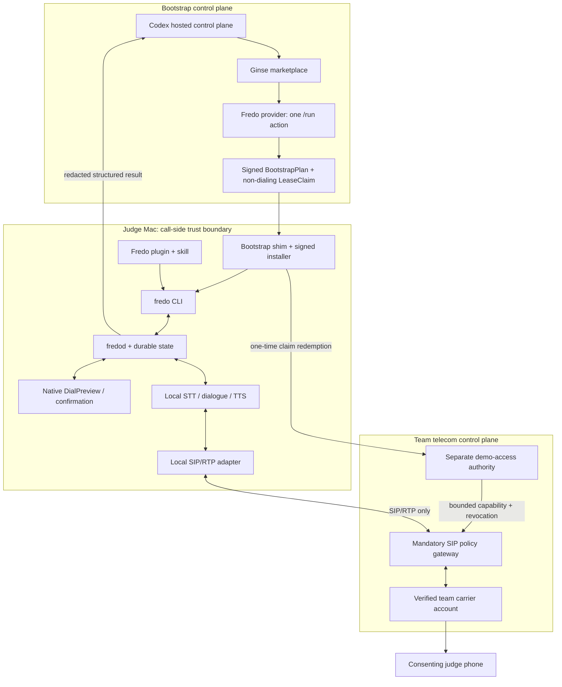

# Fredo architecture

Status: non-normative architecture hypotheses for `GOAL.md` `0.3-draft`. No end-to-end runtime exists yet.

`GOAL.md` is authoritative. The components and technologies below are replaceable; they are acceptable only if they preserve every normative invariant and pass every acceptance gate.

## Design constraints

- Ginse is the mandatory discovery and bootstrap entry point.
- Codex may use its hosted control plane for the initial prompt and bootstrap orchestration.
- Live STT, dialogue inference, TTS, call state and transcript processing run on the judge's Mac.
- Raw call audio never goes to Codex, Ginse, the Fredo provider, a model registry or hosted inference.
- The Ginse provider, demo-access authority and SIP policy gateway are separate trust roles.
- The SIP policy gateway is mandatory for the judged path, even when NAT does not require an edge.
- The team carrier credential exists only behind the gateway; an installation receives a short-lived, bounded gateway capability.
- Every dial requires a Fredo-owned native `DialPreview` and a one-use `DialAuthorization`.
- State is durable and idempotent. An uncertain carrier outcome enters `RECONCILING`, may end in `UNKNOWN_TERMINAL`, and is never redialled blindly.
- MCP, Pipecat, LiveKit, Asterisk, PyVoIP, SQLite, Docker, Python and any particular model are implementation hypotheses, not product requirements.

## System map



The media path may cross the gateway as SIP/RTP. That transit does not permit recording, transcription, hosted inference or retention. Prompts, model state, transcripts and summaries stay off the gateway.

## Trust roles and responsibilities

### Codex and the bootstrap shim

The already-installed Ginse use capability invokes the single public Fredo action, validates its schema, and obtains a deterministic plan. The same Codex task downloads and verifies the release, runs the installed `fredo` executable directly, and completes the first call after the named approvals.

A plugin installed during that task is discoverable only from a fresh Codex session. Fresh-session discovery is a post-install verification, not a prerequisite for the first call. MCP remains optional and must not own business logic.

Codex may orchestrate control actions and receive the final redacted result. It never receives raw call audio or the carrier credential.

### Ginse provider

One fixed-price HTTPS action maps the allowlisted platform profile, an independently generated 128-bit CSPRNG `install_id`, and a protected device-key thumbprint to a deterministic `BootstrapPlan`. Before `/run`, the Ginse shim creates the key, emits the ID as exactly 22 and the SHA-256 thumbprint as exactly 43 unpadded base64url characters, and never accepts either from prompt or model data. The provider owns:

- Ginse Ed25519 bearer verification;
- strict input/output schema validation;
- atomic idempotency, exact replay and stable operation IDs;
- immutable commit, release-manifest and plugin selection;
- delivery metadata for a non-dialing `LeaseClaim` pre-bound to the install, device-key thumbprint, release, and policy.

It never receives the destination, intent, caller identity, audio, transcript or result. It has no carrier credential and no dial authority.

### Demo-access authority

This is a separate service and trust role from the Ginse provider. It verifies proof of possession for the precommitted device key and durably binds one canonical redemption fingerprint to a gateway capability covering installation ID, device public key, native-helper authorization-key thumbprint, release SHA, policy digest, and expiry. It stores the terminal result before reply, replays it exactly after response loss, and rejects divergent redemption.

It owns lease issuance, per-install revocation and capability rotation. It receives no prompt, transcript, model state or carrier master credential. Claim TTL is exactly 45 minutes, leaving redemption margin after the bounded cold bootstrap; capability TTL is at most eight hours and never exceeds the judging window. Gateway use also requires device-key proof of possession, so the capability is not a transferable bearer credential.

### SIP policy gateway

The gateway is mandatory for the team-funded judged path. It is the only Fredo component allowed to use the shared team carrier account. It validates install-bound capabilities and enforces, independently of the Mac:

- destination allowlists and blocked classes;
- per-install and global concurrency;
- attempt rate and completed-call quota;
- call-duration and judging-window limits;
- revocation and the operator kill switch.

The gateway may relay SIP/RTP and normalize carrier-specific signalling. It must not store recordings, prompts, transcripts, model state or summaries. Its logs and CDR evidence are redacted.

### Native confirmation surface

A signed local helper creates and protects a separate authorization signing key, whose thumbprint is registered during demo-access redemption and bound into the gateway capability. It renders the canonical `DialPreview`: full destination, verified caller identity, purpose, synthetic-voice disclosure, duration cap and policy/cost profile. Approval produces a helper-signed, single-use `DialAuthorization` that expires within 60 seconds and binds the canonical hash of every `DialRequest` field, capability, policy, release, and authorization-key thumbprint.

The gateway verifies the helper signature and all bindings and atomically consumes the authorization ID with the dial idempotency key before any carrier attempt. Capability plus device-key proof alone cannot dial. This interaction is distinct from Codex's download/write approval. Rejection, expiry, request mutation, or cancellation before `DIAL_COMMITTED` produces zero SIP `INVITE`; a later cancellation can emit only the persisted path's `CANCEL`/`BYE`, never a new `INVITE`.

### `fredo` CLI and `fredod`

The CLI is the stable automation boundary for Codex, tests and humans. Candidate commands are:

```text
bootstrap plan|apply
doctor [--offline]
call prepare|confirm|start|status|cancel|result
```

Every non-interactive command emits structured output and meaningful exit codes. `fredod` owns durable state transitions, idempotency, confirmation consumption, policy checks, media lifecycle, recovery and redacted result emission. The storage engine is selected by evidence; SQLite WAL is a plausible single-install candidate, not a requirement.

### Local conversation and media

The reference voice engine is chosen by the 100-turn benchmark in `GOAL.md`. Candidate pipelines include:

```text
streaming local STT -> compact local dialogue model -> local TTS
```

and the feature-flagged Moshi-MLX experiment. Pipecat may own VAD, interruption and adapter composition. LiveKit may provide a local realtime room and supervision. LiveKit SIP, Asterisk or a smaller adapter may bridge local media to the mandatory gateway. None is accepted by preference alone.

The installer packages or fetches the selected runtime. Python 3.12, Docker Desktop and Homebrew are not clean-machine prerequisites unless the final signed release packages them without an additional manual step.

## Call state machine

The normative transition table is in `GOAL.md` Section 8.2. The principal path is:

```text
DRAFT -> PREPARED -> AUTHORIZED -> DIAL_COMMITTED -> RINGING -> CONNECTED
                                      -> CANCEL_REQUESTED -> HANGUP_COMMITTED
                                      -> RECONCILING -> terminal state
```

The authorization binds the normalized destination, verified caller identity, canonical intent, maximum duration, locale, policy version, install ID, release SHA, lease ID and idempotency key.

Dial, cancel, and hangup effects are preceded by durable `DIAL_COMMITTED`, `CANCEL_REQUESTED`, and `HANGUP_COMMITTED` events. When a timeout or crash leaves carrier acceptance uncertain, Fredo persists `RECONCILING`, queries the gateway using the existing idempotency key, and does not create another call. Reconciliation ends in `COMPLETED`, `CANCELLED`, `FAILED`, or `UNKNOWN_TERMINAL`; a later attempt requires a new native authorization.

## End-to-end judged sequence

```mermaid
sequenceDiagram
    participant J as Judge
    participant C as Codex task
    participant G as Ginse / provider
    participant F as Fredo on Mac
    participant A as Demo-access authority
    participant W as SIP policy gateway
    participant P as Judge phone

    J->>C: One prompt with consenting PHONE_E164
    C->>C: Create protected device key and random install ID
    C->>G: Resolve profile + key thumbprint; no destination or intent
    G-->>C: Signed plan + one-time non-dialing claim
    C->>F: Install exact release and invoke fredo directly
    F->>A: Idempotent claim redemption + key proof
    A-->>F: Bounded gateway capability
    F-->>J: Native DialPreview
    J->>F: Confirm once
    F->>F: Sign and persist DialAuthorization
    F->>W: Dial request + helper attestation + device proof
    W->>W: Verify and atomically consume authorization
    W->>P: PSTN call from verified team identity
    P-->>F: Bidirectional SIP/RTP via gateway
    F-->>C: Redacted structured terminal result
```

The phone number remains in the original Codex task and local Fredo request. It is structurally absent from the Ginse request and provider response.

## Network and data boundaries

### Bootstrap phase

After explicit Codex approval, Fredo may reach the declared Codex/Ginse control endpoints, Fredo provider, demo-access authority, signed artifact origins and pinned runtime/model origins. Every executable byte must match the signed manifest before activation.

### Live-call phase

The call-side runtime permits only local IPC plus the declared demo-access, SIP/RTP gateway and carrier paths required by the active phase. Model registries, Ginse and hosted STT/LLM/TTS endpoints are denied. The gateway may see audio in transit but may not retain or interpret it.

The full transcript stays local. Only a policy-redacted structured result is returned to Codex; Ginse receives no result.

### Local data root

```text
<operator-selected-data-root>/
  config/
  secrets/
  manifests/
  artifacts/
  models/
  runtimes/
  fredo-state/
  run/
  transcripts/
  evidence/
```

Recordings are disabled. Logs redact phone numbers and secrets. Capabilities use the macOS Keychain where practical, while server-side expiry and quotas remain the real containment boundary.

## Deployment profiles

### `mac-m4pro-24gb` — mandatory

- native local conversation inference and durable state;
- signed native confirmation helper;
- one outbound call at a time;
- no prepared Fredo runtime, Homebrew, Docker Desktop or Python dependency assumed.

### `ginse-provider-public` — mandatory

- team-controlled HTTPS provider for the one Ginse action;
- bootstrap plans plus authentication/idempotency state only;
- no destination, call content, carrier key or dial authority.

### `demo-access-authority` — mandatory

- separate claim-redemption and per-install revocation role;
- no Ginse bearer verification, call content or carrier master credential.

### `sip-policy-gateway` — mandatory

- team-controlled server-side enforcement and verified carrier integration;
- shared demo carrier credential never exported to an installation;
- RTP transit allowed, recording and call-content processing forbidden.

### BYOK — post-hackathon

Per-install carrier ownership and BYOK are explicitly deferred. They must preserve the same confirmation, policy, idempotency, privacy and evidence contracts when added.

## Rejected assumptions

- Hosted Codex orchestration does not imply hosted call-side inference.
- A direct Mac-to-carrier path is not acceptable for the judged shared-key demo because it bypasses server-side enforcement.
- A local confirmation rendered only as terminal text is not the required native authorization surface.
- A retry after an uncertain dial result is not recovery.
- An elaborate media stack is not evidence of correctness; only the acceptance measurements are.
